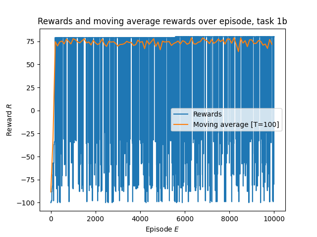
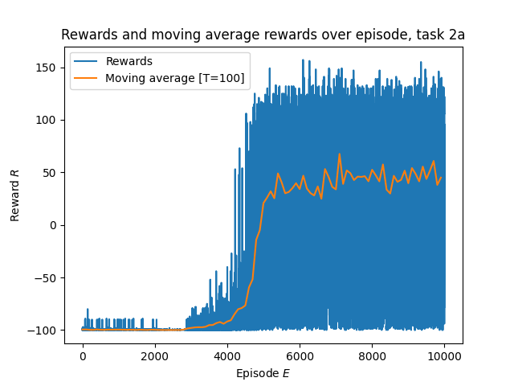

# Homework B - Deep Reinforcement Learning

## 1.a )

Setting $\epsilon=0$ causes the algorithm to use a greedy algorithm, meaning it will always use the largest Q-values when choosing an action.
As we can see, the algorithm reaches a score of 75 and flatlines after that, due to no exploration. There is no difference between the rewards and the moving average, due to the algorithm always using the best move.

## 1.b )

Here we use the $\epsilon$-greedy algorithm, which means that we explore with a probability of probability of $\epsilon=0.001$. This could potentially lead to us finding better rewards, i.e. stacking more blocks. We can see on the rewards that we sometimes explore, causing the plot to dip.

## 1.c )

We can see here that the average score is significantly lower than in the predetermined case. There, the state space was simpler due to each tile coming at a predefined sequence. Here, all of them come randomly, which makes learning more difficult. In regular QLearning, a slight difference in the state causes us to use a completely different QValue. However, we can see that the agent manages to stack the tiles highly in certain turns, reaching rewards of over 100.

## 1.d )

In the case of an 8x8 grid, the agent completely fails to learn a valid strategy. The state space and action space are significantly larger, and since we use QLearning, the agent needs to visit a state-action pair to give it a reward.
In this case, a deep reinforcement learning method seems more promising, where the Q-values are instead approximated using a neural network. This hopefully means that we don't need to visit each state to assign a Q-value to an action.

## 2.a )

We can see that, using a similar setup to 1.c), we get a significantly better performance using Deep Q Learning. The average reward is better, as well as the best rewards. Since we're using neural networks to approximate the QValues, similar states can give us similar QValues, which means that the network can generalize the findings of one state to another.

## 2.b )

I could not get the network to learn anything for the large space. Since the state space is larger, I tried managing it in various ways, but failed to do so. Here are some methods I tried:

- The same as in task one, where the board was flattened to a 64 dimensional array, and then appended to the tile.

- Adding convolutional layers at the beginning to reduce the dimensionality of the state, as shown in the task description.

- Pretraining an autoencoder to reduce an 8x8 grid to a lower dimensional space, and then using that for training the network.

Seeing as neither of these worked, I suspect that the problem might lie in the given parameters since Deepmind managed to use a similar architecture to train their agent across many Atari games with significantly larger state space.
However, I did not get the chance to explore further, unfortunately.
